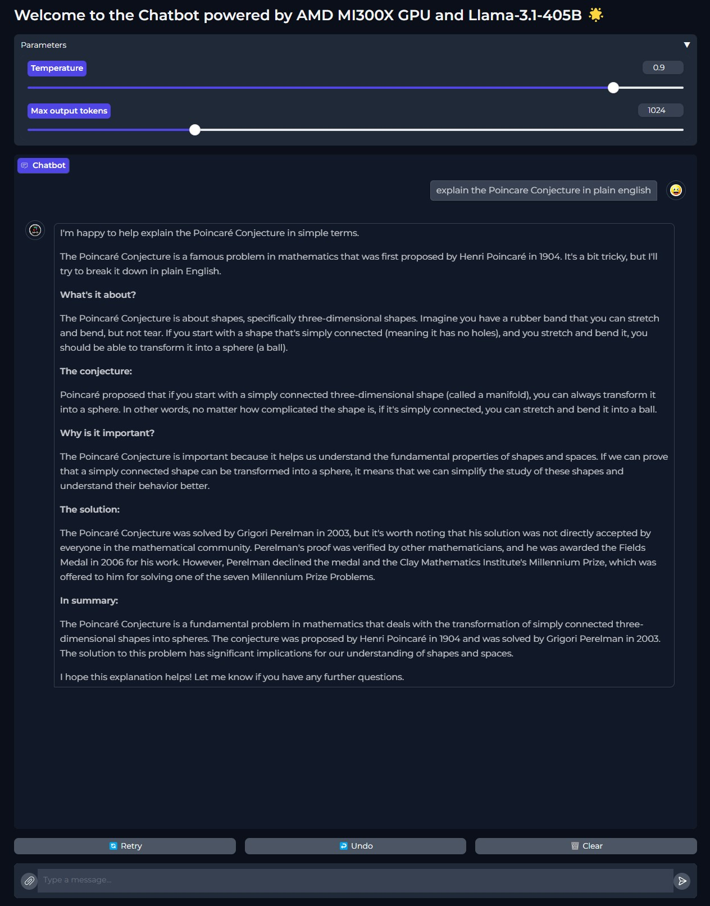
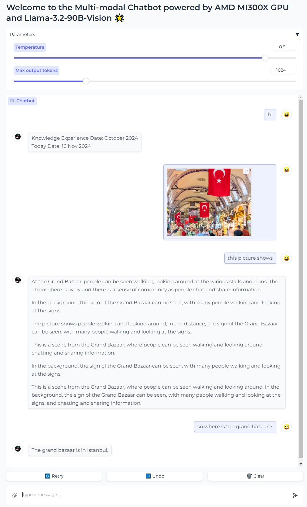

# llm_demo suites

## vllm chatbot

- launch vllm docker & clone this repo
```sh
docker run -it --device=/dev/kfd --device=/dev/dri --group-add video --shm-size 16G --security-opt seccomp=unconfined --security-opt apparmor=unconfined --cap-add=SYS_PTRACE -v $(pwd):/workspace --name vllm_demo rocm/vllm:rocm6.2_mi300_ubuntu20.04_py3.9_vllm_0.6.4

cd /workspace
git clone https://github.com/ROCm/llm_demo.git
cd llm_demo/vllm/
```

### text-only chatbot: LL3.1, openai format
- launch vllm endpoint (if you have model saved in HF directory format, move to $(pwd) so that vllm can reuse the model)
```sh
HUGGINGFACE_HUB_CACHE=$(pwd) PYTORCH_TUNABLEOP_ENABLED=1 VLLM_USE_TRITON_FLASH_ATTN=0 MODEL=meta-llama/Meta-Llama-3.1-405B-Instruct TP=8 PORT=8011 nohup ./launch_vllm_ep.sh &
```

- check vllm endpoint status
wait until the following message 
```sh
INFO:     Uvicorn running on socket ('0.0.0.0', 8011) (Press CTRL+C to quit)
```
in *tail nohop.out*

- launch uxui
```sh
pip install gradio
python3 demo_gradio_ll3.1.py --model-url http://localhost:8011/v1
```

- access vllm ep through the web browser (Public URL changes)
```sh
Running on local URL:  http://127.0.0.1:8022
Running on public URL: https://xxxxx.gradio.live
```



### multimodal chatbot: LL3.2, openai format
- launch vllm endpoint
```sh
HUGGINGFACE_HUB_CACHE=$(pwd) PYTORCH_TUNABLEOP_ENABLED=1 VLLM_USE_TRITON_FLASH_ATTN=0 MODEL=meta-llama/Llama-3.2-90B-Vision-Instruct TP=8 PORT=8011 nohup ./launch_vllm_ep.sh &
```

- check vllm endpoint status
wait until the following message 
```sh
INFO:     Uvicorn running on socket ('0.0.0.0', 8011) (Press CTRL+C to quit)
```
in *tail nohop.out*

- launch uxui
```sh
pip install gradio
python3 demo_gradio_ll3.2.py --model-url http://localhost:8011/v1
```

- access vllm ep through the web browser (Public URL changes)
```sh
Running on local URL:  http://127.0.0.1:8022
Running on public URL: https://xxxxx.gradio.live
```


## tgi
...

## trtllm-triton
...
